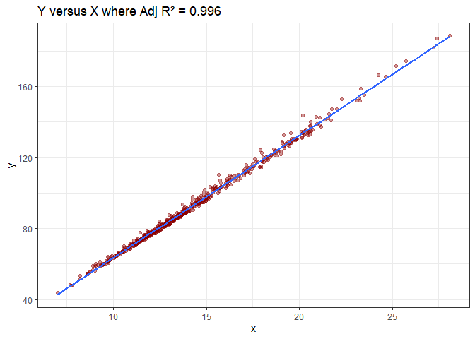
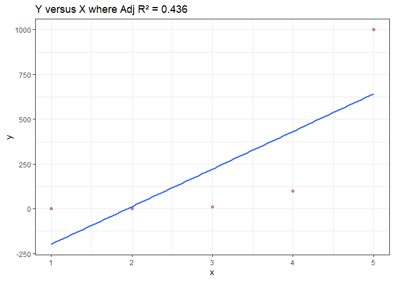
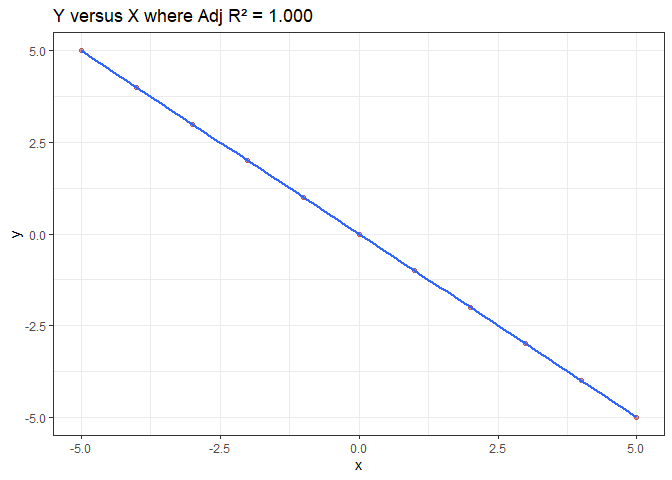

Assignment-B1
================
Alex Pieters
2024-11-01

***This assignment covers making a function in R, documenting it, and
testing it.***

In the mini data analysis I repeated code for making scatter plots to
explore the relationship between variables. Therefore, in this
assignment, I will make a function that creates a scatter plot and
returns the linear correlation between two variables.

# Setup

Begin by loading the cancer_sample data from *datateachr* and the
tidyverse and testthat package below:

``` r
library(datateachr) # contains cancer_sample data
library(tidyverse)
library(testthat) # needed to test function
```

## Exercise 1 and 2

In this exercise, I’ll be making a function which plots two variables
against each other and displays the adjusted R-squared value from a
linear regression model. The function returns the plot, the R-squared
and p-value.

**Let’s make the function!**

*roxygen2* tags are used to document the function.

``` r
#' @title Linear regression model plot and extracted R-squared and p-value
#' 
#' The function plots two variables x versus y and applies a linear regression model to calculate #' the adjusted R-squared and p-value
#' 
#' @param x numeric vector for independent variable
#' @param y numeric vector for dependent variable
#' 
#' @return numeric value of adjusted R-squared and p-value, and the plot
#' @export
#' 
#' @examples
#' x <- c(1,2,3,4,5)
#' y <- c(0.1,1,10,100,1000)
#' linearity_check(x, y)
#' 

linearity_check <- function(x,y, ...){
  
   # Check for number of inputs
   if (length(list(...)) > 0) {
    stop("Only two inputs (x and y) are allowed!")
  }
  
  # Check for any NAs
  if (any(is.na(x)) || any(is.na(y))) {
    stop("The input contains NA values!")
  }
  
    # Check if inputs are numeric
  if (!is.numeric(x) || !is.numeric(y)) {
    stop("Imputs x and y must be numeric!")
  }
  
   # Check if inputs are vectors
  if (!is.vector(x) || !is.vector(y)) {
    stop("Inputs x and y must be vectors!")
  }
  
  # Check if vectors have same length
  if (length(x) != length(y)) {
    stop("Input vectors must have the same length!")
  }
  
  # Check if there are enough data points for regression
  if (length(x) < 3) {
    stop("Need at least 3 data points for regression!")
  }
    
  
  # Make a tibble with both variables
  my_data = tibble(x,y)

  # Create a linear model: y = Coef*x + intercept
  my_lm <- lm(y ~ x,data = my_data) # model: y ~ x

  # Extract strength of linear model: adj.r.square and p.value
  adj_rsqd <- broom::glance(my_lm)$adj.r.squared # call glance() function within broom package without loading package
  pvalue <- broom::glance(my_lm)$p.value

  # Plot y versus x and add adjusted R-squared value

  my_plot<-my_data %>%
    ggplot(aes(x,y)) + # plot y versus x
    geom_point(alpha = 0.4, color = "darkred") + # adjusted alpha to show the overlap region     between the diagnosis status
    geom_smooth(method = lm, se=FALSE) + # added a linear trendline
    ggtitle(sprintf("Y versus X where Adj R² = %.3f", adj_rsqd)) +
    theme_bw()

  return(list(r_squared=adj_rsqd,p_value=pvalue,plot=my_plot)) # return Rsqd, p-value and plot
}
```

## Exercise 3

Now it’s time to try the function with variables from the cancer_sample
data (e.g., mean radius and perimeter).

``` r
x = cancer_sample$radius_mean # stores the mean radius
y = cancer_sample$perimeter_mean # stores the mean perimeter

# Use the function
output <-linearity_check(x,y)

# View plot
output$plot
```

    ## `geom_smooth()` using formula = 'y ~ x'

<!-- -->

``` r
# View R-square
output$r_squared
```

    ## [1] 0.9957076

``` r
# View p-value
output$p_value
```

    ## value 
    ##     0

The plot shows that mean radius and perimeter are linearly related to
each other with an adjusted R-squared and p-value of 0.996 and 0. The
p-value tests that the null hypothesis of true slope of the regression
line is 0, which is false. Therefore, a strong linear correlation exist
between the mean perimeter and radius.

Now let’s try an exponential vector for the y-axis.

``` r
x <- c(1,2,3,4,5)
y <- c(0.1,1,10,100,1000)
linearity_check(x, y) # call function and print output
```

    ## $r_squared
    ## [1] 0.4362344
    ## 
    ## $p_value
    ##     value 
    ## 0.1361759 
    ## 
    ## $plot

    ## `geom_smooth()` using formula = 'y ~ x'

<!-- -->

The correlation between x and y is exponential, therefore the linear fit
is not strong (e.g., R-squared = 0.436 & p-value \> 0.05).

Now let’s try to plot variables with an inversely proportional
relationship (e.g., y = -x).

``` r
x <- c(-5:5)
y <- c(5:-5)
linearity_check(x, y) # call function and print output
```

    ## Warning in summary.lm(x): essentially perfect fit: summary may be unreliable
    ## Warning in summary.lm(x): essentially perfect fit: summary may be unreliable
    ## Warning in summary.lm(x): essentially perfect fit: summary may be unreliable
    ## Warning in summary.lm(x): essentially perfect fit: summary may be unreliable

    ## $r_squared
    ## [1] 1
    ## 
    ## $p_value
    ##         value 
    ## 6.033503e-151 
    ## 
    ## $plot

    ## `geom_smooth()` using formula = 'y ~ x'

<!-- -->

Indeed, the output is as expected. However, as the input is y = -x, a
warning message is given by default indicating a perfect fit.

## Exercise 4

In this part of the assignment, I will test the function to ensure it
works as expected.

Let’s try and catch the following errors: input has NA, is not numeric,
has different length, and is less than 3 (need at least 3 data points
for regression).

``` r
## Non-redundant inputs
# define y
y <- c(1:3)

test_that("x and y are a numeric vector", {
  expect_error(linearity_check(c(1, 2, NA), y)) # NA value
  expect_error(linearity_check("a", y)) # x is not numeric
  expect_error(linearity_check(c(1, 2), y)) # not same length
  expect_error(linearity_check(c(1,2), c(5,10))) # length less than 3
})
```

    ## Test passed 🥳

All the non-redundant inputs tests have passed indicating that the
function is catching these errors. Now let’s test for additional
erroneous inputs.

``` r
x <- c(0,2,4,3,4)
y <- tibble(c(1:5),c(5:1))

test_that("x and y are a numeric vector", {
  expect_error(linearity_check(x)) # not enough inputs. Need x and y
  expect_error(linearity_check(x, y)) # y is not a numeric vector
  expect_error(linearity_check(c(1:3), c(1,6,9),c(2:3))) # more than two inputs
})
```

    ## Test passed 😀

Finally, let’s test the output.

``` r
x = cancer_sample$radius_mean # stores the mean radius
y = cancer_sample$perimeter_mean # stores the mean perimeter
output<-linearity_check(x,y)

test_that("output has expected components", {
  expect_type(output, "list") 
  expect_named(output, c("r_squared", "p_value", "plot"))
  expect_equal(length(output),3)
})
```

    ## Test passed 😸
